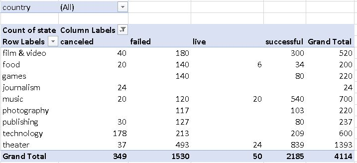

# Clues to Kickstarter

## This series of analysis takes from a very popular projet funding site called Kickstarter.The idea behind analysis was to try and find patterns and insights as to what makes a successful campaign on this platform.Data was very enlightening and definitly shows some intereseting results.

## Given the provided data, the three main conclusions I can draw about kickstarter campaigns are:

### A.Kickstarter is a funding platform popular for certain types of muisic namely: hardwarve, indierock,pop,electronic music and classical, as well as certian performative arts such as theatre plays and media arts such as,film shorts,documentaries,and television.

### B.It seems that there are alot of people using kickstarter for funding for plays.Jan-May seems to be the best time to launch a successful campaign. 

### C.There are so many people with such amazing creative ideas that they want to share with the world!

# This is certainly good information to start with to help inform you what your up against in each category. 

# Some limitations of this dataset Include:

## We don't get to see how fully each person filled out their campaign page or examine the quality of the work they put into their project. We dont know if they shared their campiagn via marketing or elsewhere.

# Other table or graphs? 

## Could create a scatterplot based on the purpose or intention of each project  (entertainment, activism, awareness, aesthetic beauty, nature conservation etc...),in order to help promote the projets to certain philanthropical organizations,angel investors etc, to choose the project they want to get invoved with.

## Could also do some stats on which dollar ammounts are most successful. I would think that there could be a correlation or sweet spot in the ammount of money being asked for example min pledge vs any dollar amount accepted, and those that are successful.  
