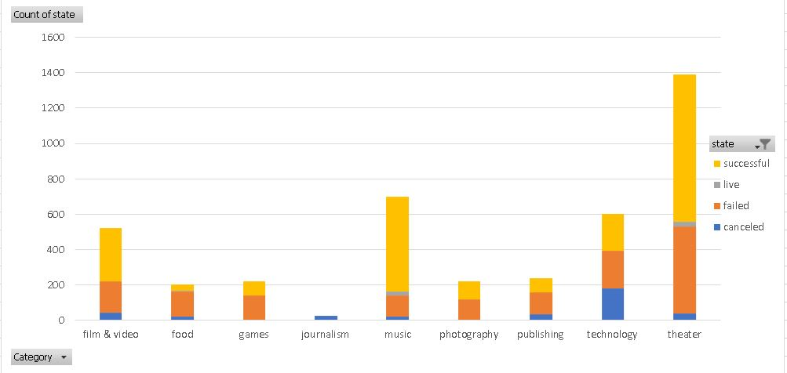
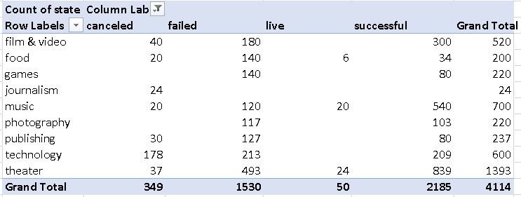
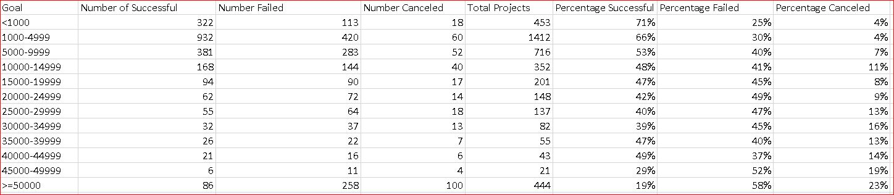
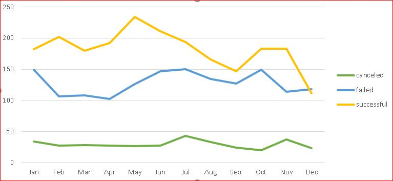
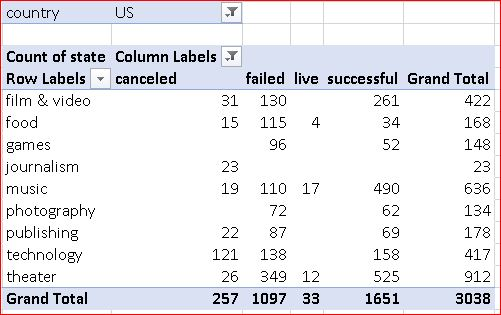

# Clues to Kickstarter

## This series of analysis takes from a very popular projet funding site called Kickstarter. The data in this specific report centers on the US campaigns or worldwise as noted. The idea behind analysis was to try and find patterns and insights as to what makes a successful campaign on this platform.Data was very enlightening and definitly shows some intereseting results.

## Given the provided data, the three main conclusions I can draw about kickstarter campaigns are:

### A.Kickstarter is a funding platform popular for certain types of muisic,performative arts and media arts such as film. These three categories, Theatre, Muisc and Film are the most successful of the campaign categories analyzed.Rate of failure is lowest in Muisc at 22%, Second lowest in Film at 49% and third lowest in theatre at 66%

### B.The best ammount to ask based on success rate worldwide is firstly less than 1,000 with a 71% success rate and secondly 1,000-4,999 at 66% success rate.

### C. On a worldwide scale, Jan-May appears to be to be the best time to launch a successful campaign.

# This is certainly good information to start with to help inform you what your up against in each category. 

# Some limitations of this dataset Include:

## We don't get to see how fully each person filled out their campaign page or examine the quality of the work they put into their project. We dont know if they shared their campiagn via marketing or elsewhere.

# Other table or graphs? 

## Could create a scatterplot based on the purpose or intention of each project  (entertainment, activism, awareness, aesthetic beauty, nature conservation etc...),in order to help promote the projets to certain philanthropical organizations,angel investors etc, to choose the project they want to get invoved with.

## Could also do some stats on which dollar ammounts are most successful. I would think that there could be a correlation or sweet spot in the ammount of money being asked for example min pledge vs any dollar amount accepted, and those that are successful.  
